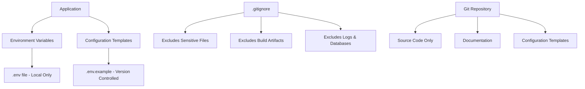

# Design Document

## Overview

This design covers getting the TradingView webhook server ready for Git with a simple, lightweight setup that prioritizes speed and minimal resource usage. The server takes webhook signals from TradingView, trades through SimpleFX API, and has a web dashboard.

Main focus areas:
1. **Basic Security**: Move sensitive data to environment variables and create .gitignore
2. **Lightweight**: Keep repo small with fast sync and minimal resource use
3. **Simple Git**: Standard git workflow without heavy security overhead
4. **Quick Setup**: Minimal configuration that works reliably

## Architecture

### Security Architecture



### Repository Structure

```
project-root/
├── .env.example              # Environment variable template
├── .gitignore               # Comprehensive exclusion rules
├── README.md                # Professional documentation
├── package.json             # Essential dependencies only
├── tsconfig.json            # TypeScript configuration
├── src/                     # Source code
│   ├── config.ts            # Environment-based configuration
│   ├── server.ts            # Main server application
│   ├── database.ts          # Database management
│   ├── services/            # External service integrations
│   ├── utils/               # Utility functions
│   └── types/               # Type definitions
├── public/                  # Static web assets
│   ├── index.html           # Primary dashboard
│   └── index2.html          # Secondary dashboard
└── docs/                    # Additional documentation
    ├── DEPLOYMENT.md        # Deployment guide
    ├── API.md               # API documentation
    └── SECURITY.md          # Security guidelines
```

## Components and Interfaces

### Environment Configuration System

**Purpose**: Centralized management of all sensitive configuration through environment variables.

**Key Components**:
- `config.ts`: Environment variable loader with validation
- `.env.example`: Template showing all required variables
- Configuration validation on application startup

**Interface**:
```typescript
interface EnvironmentConfig {
  // Server Configuration
  PORT: number;
  SERVER_IP: string;
  DEBUG_LEVEL: string;
  
  // SimpleFX API Configuration
  SIMPLEFX_API_KEY: string;
  SIMPLEFX_API_SECRET: string;
  SIMPLEFX_API_KEY2: string;
  SIMPLEFX_API_SECRET2: string;
  
  // Authentication
  STATUS_AUTH_USERNAME: string;
  STATUS_AUTH_PASSWORD: string;
  STATUS_AUTH2_USERNAME: string;
  STATUS_AUTH2_PASSWORD: string;
  
  // SSL Configuration
  SSL_CERT_PATH?: string;
  SSL_KEY_PATH?: string;
}
```

### Simple Git System

**Purpose**: Basic git configuration with minimal overhead for fast, reliable operations.

**Key Components**:
- Standard git configuration (user.name, user.email)
- Lightweight pre-commit hook for basic sensitive file check
- Simple branching strategy (main branch)
- Basic .gitignore without complex patterns

### Documentation System

**Purpose**: Provide comprehensive, professional documentation for deployment and maintenance.

**Key Components**:
- README.md: Project overview and quick start
- DEPLOYMENT.md: Detailed deployment instructions
- API.md: Complete API endpoint documentation
- SECURITY.md: Security best practices and requirements

### Repository Optimization System

**Purpose**: Maintain minimal repository size while preserving all essential functionality.

**Key Components**:
- Comprehensive .gitignore configuration
- Dependency optimization
- Build artifact exclusion
- Log and database file exclusion

## Data Models

### Environment Variable Template

```bash
# Server Configuration
PORT=443
SERVER_IP=your_server_ip
DEBUG_LEVEL=normal

# SimpleFX API Configuration
SIMPLEFX_API_KEY=your_primary_api_key
SIMPLEFX_API_SECRET=your_primary_api_secret
SIMPLEFX_API_KEY2=your_secondary_api_key
SIMPLEFX_API_SECRET2=your_secondary_api_secret

# Authentication
STATUS_AUTH_USERNAME=admin
STATUS_AUTH_PASSWORD=your_secure_password
STATUS_AUTH2_USERNAME=admin
STATUS_AUTH2_PASSWORD=your_secure_password2

# Account Configuration
DEFAULT_ACCOUNT_NUMBER=your_default_account
DEFAULT_ACCOUNT_NUMBER2=your_secondary_account

# SSL Configuration (Optional)
SSL_CERT_PATH=./ssl/cert.pem
SSL_KEY_PATH=./ssl/key.pem
```

### Git Configuration Model

```bash
# Basic Git Configuration
git config user.name "Your Name"
git config user.email "your.email@example.com"

# Repository Configuration
git config core.autocrlf false
git config core.filemode false
git config pull.rebase true
git config init.defaultBranch main
```

## Error Handling

### Environment Variable Validation

**Strategy**: Validate all required environment variables on application startup with clear error messages.

**Implementation**:
- Check for missing required variables
- Validate variable formats (URLs, numbers, etc.)
- Provide specific error messages for each missing variable
- Exit gracefully with error code 1 if validation fails

### Git Security Validation

**Strategy**: Ensure all commits are properly signed and authenticated.

**Implementation**:
- Pre-commit hooks to verify GPG signing
- Validation of Yubikey presence before commits
- Branch protection rules on remote repository
- Automated security checks in CI/CD pipeline

### Documentation Consistency

**Strategy**: Maintain professional, consistent documentation without AI-detectable patterns.

**Implementation**:
- Use clear, technical language
- Avoid emoticons and casual expressions
- Focus on factual, actionable information
- Regular review for consistency and accuracy

## Testing Strategy

### Basic Testing

**Objective**: Verify basic functionality without heavy resource usage.

**Tests**:
1. **Sensitive File Check**: Simple scan for common sensitive file patterns
2. **Git Configuration**: Verify basic git settings are applied
3. **Repository Structure**: Check essential files are properly organized
4. **Quick Setup Validation**: Test that setup instructions work on clean environment

## Implementation Phases

### Phase 1: Basic Security
- Create simple .gitignore file
- Move sensitive data to environment variables
- Create .env.example template

### Phase 2: Lightweight Git Setup
- Configure basic git settings
- Create minimal pre-commit hook
- Remove heavy validation from existing hooks

### Phase 3: Quick Documentation
- Create concise README.md
- Add essential setup instructions