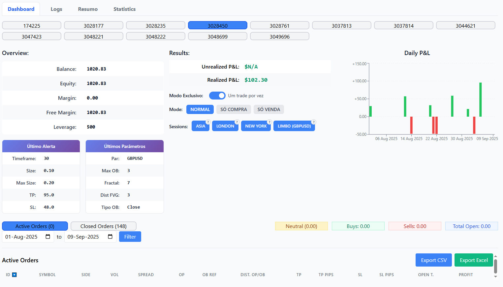

# WingTradeBot

TradingView webhook server that executes automated trades through SimpleFX API. Receives webhook signals from TradingView indicators and places trades with configurable risk management parameters.

## Features

- **Webhook Processing**: Receives and processes TradingView webhook signals
- **SimpleFX Integration**: Executes trades through SimpleFX API with dual API key support
- **Web Dashboard**: Real-time monitoring interface for account status and trade history
- **Risk Management**: Configurable position sizing, stop loss, and take profit levels
- **Session Trading**: Supports Asia, London, New York, and Limbo trading sessions
- **Database Logging**: SQLite database for trade history and account settings
- **WebSocket Market Data**: Real-time price feeds for accurate trade execution

## Dashboard Preview



*Real-time trading dashboard showing account status, active positions, trading controls, and performance metrics*

## Requirements

- Node.js 16+ and npm
- SimpleFX trading account(s) with API access
- TradingView Pro account for webhook functionality
- Linux server with SSL certificate (for production)

## Configuration

The server configuration is managed through `src/config.ts` which is excluded from version control for security.

### Required Configuration
- SimpleFX API credentials (primary and secondary)
- Authentication passwords for dashboard access
- Default account numbers
- Server IP and allowed webhook IPs

## Installation

1. **Set up Git security** (required for development):
```bash
./scripts/setup-git.sh
```
See `docs/YUBIKEY_SETUP.md` for complete Yubikey configuration.

2. Install dependencies:
```bash
npm install
```

3. Build the TypeScript project:
```bash
npm run build
```

4. Start the server:
```bash
npm start
```

For development with auto-reload:
```bash
npm run dev
```

## API Endpoints

### Webhook Endpoints
- `POST /webhook` - Primary webhook endpoint for TradingView signals
- `POST /webhook2` - Secondary webhook endpoint

### Dashboard Access
- `GET /` - Main dashboard (requires secondary authentication)
- `GET /status` - Account status page (requires secondary authentication)
- `GET /status2` - Secondary status page (requires primary authentication)

### API Endpoints
- `GET /api/account-settings/:loginNumber` - Get account trading settings
- `POST /api/account-settings/:loginNumber` - Update account trading settings
- `GET /api/statistics/:accountId` - Get trading statistics for account
- `GET /api/list-accounts` - List all accessible accounts
- `GET /api/test-keys` - Test API key connectivity
- `GET /api/test-accounts` - Test account access

## Webhook Configuration

Configure TradingView webhooks to send JSON payloads with the following structure:

```json
{
  "action": "B",
  "symbol": "EURUSD",
  "volume": 0.1,
  "takeProfit": 50,
  "stopLoss": 25,
  "loginNumber": "your_account_number",
  "alertId": "unique_alert_identifier"
}
```

### Required Parameters
- `action`: Trade direction ("B" for buy, "S" for sell)
- `symbol`: Trading instrument symbol
- `volume`: Position size
- `takeProfit`: Take profit in pips
- `stopLoss`: Stop loss in pips
- `loginNumber`: SimpleFX account number
- `alertId`: Unique identifier for the alert

## Trading Sessions

The system supports four trading sessions with individual enable/disable controls:

- **Asia Session**: 21:00-05:00 BRT
- **London Session**: 05:00-10:00 BRT  
- **New York Session**: 10:00-18:00 BRT
- **Limbo Session**: 18:00-21:00 BRT

## Account Management

### Trading Modes
- `NORMAL`: Allow both buy and sell orders
- `BUY_ONLY`: Only execute buy orders
- `SELL_ONLY`: Only execute sell orders

### Exclusive Mode
When enabled, prevents multiple orders in the same direction for the same symbol.

## Database

Uses SQLite database (`sfx_historical_orders.db`) to store:
- Trade history and outcomes
- Account settings and configurations
- Session preferences
- Webhook processing logs

## Process Management

For production deployment with PM2:

```bash
# Start with PM2
npm start

# Stop the process
npm stop

# Restart the process
npm restart

# View logs
npm run logs
```

## SSL Configuration

For HTTPS operation, place SSL certificate files in the `ssl/` directory:
- `ssl/cert.pem` - SSL certificate
- `ssl/key.pem` - Private key

## Monitoring

The web dashboard provides:
- Real-time account balance and equity
- Open positions and order history
- Trading session status
- P&L statistics and performance metrics
- Account settings management

## Security

- **GPG signed commits required** - All commits must be signed with Yubikey
- Basic authentication for dashboard access
- IP whitelist for webhook endpoints
- Environment variable configuration for sensitive data
- SSL/TLS encryption for production deployment
- Hardware security key requirement for all contributors

### Git Security Setup

All developers must configure GPG signing with Yubikey:

1. Follow the setup guide: `docs/YUBIKEY_SETUP.md`
2. Run the configuration script: `./scripts/setup-git.sh`
3. Add your GPG public key to GitHub
4. Verify signing works: `git commit -S -m "Test commit"`

**Note**: Unsigned commits will be rejected by branch protection rules.

## Troubleshooting

### Common Issues

1. **API Connection Errors**
   - Verify SimpleFX API credentials
   - Check account numbers and API key permissions
   - Use `/api/test-keys` endpoint to validate connectivity

3. **Webhook Not Processing**
   - Verify TradingView webhook URL configuration
   - Check server IP whitelist settings
   - Review webhook logs in dashboard

4. **SSL Certificate Issues**
   - Ensure certificate files exist in `ssl/` directory
   - Verify certificate validity and permissions
   - Check server IP configuration

### Log Files
- `trades.log` - Trade execution logs
- `error.log` - Error and debugging information
- Database logs available through dashboard interface